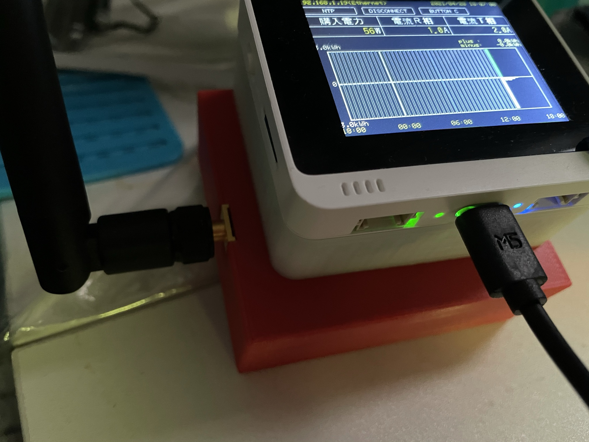
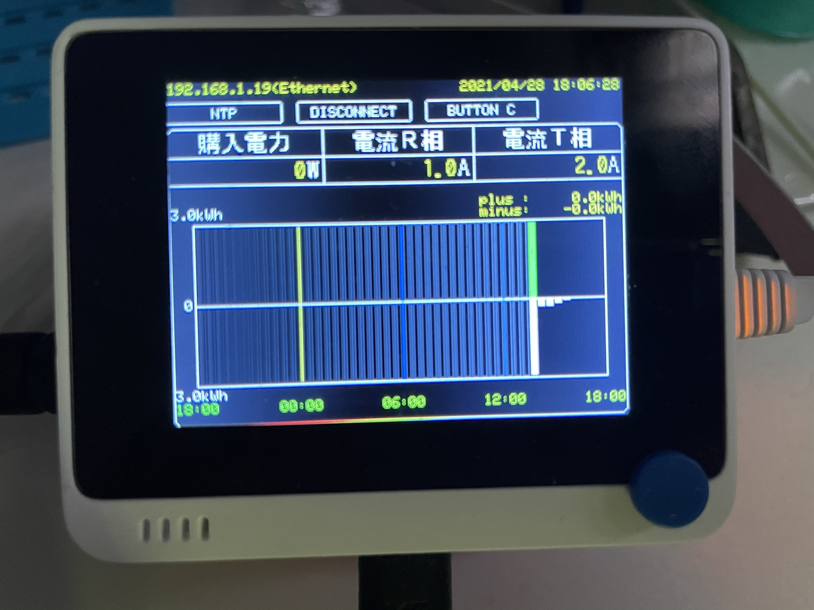
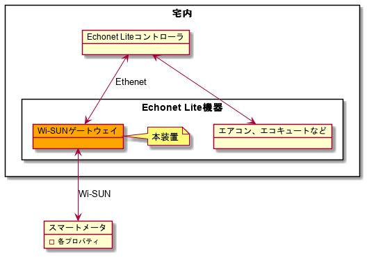

# Wio_WisunGateway

# 概要

- Wio Terminal を使った、Wi-SUN ゲートウェイです。
- 機能的には、W-SUN ベースでやり取りされるスマートメータとの通信を Ethernet に変換するものとなります。

# 装置外観

- 全体（左側にあるＬ型の黒い部品はアンテナ、Wio Terminal の直下にある白い部品は EthernetHAT です。）
  
- 表示画面
  

# 構成図



# 必要なもの

- ハードウェア
  - Wio Terminal 本体
  - [Wio Terminal 用 Ethernet HAT キット](https://www.windesign.work/%e8%a3%bd%e5%93%81%e4%b8%80%e8%a6%a7/%e3%83%8f%e3%83%bc%e3%83%89%e3%82%a6%e3%82%a7%e3%82%a2/wio-terminal%e5%90%91%e3%81%91wiz550io%e5%a4%89%e6%8f%9b%e5%9f%ba%e6%9d%bf/wio-terminal%e7%94%a8ethernet-hat%e3%82%ad%e3%83%83%e3%83%88)
  - [ラズパイ用 Wi-SUN インタフェースボード](https://www.windesign.work/%e8%a3%bd%e5%93%81%e4%b8%80%e8%a6%a7/%e3%83%8f%e3%83%bc%e3%83%89%e3%82%a6%e3%82%a7%e3%82%a2/rpiwi-001)
  - ラズパイ用スタッキングコネクタ
    - [13.5mm 高](https://akizukidenshi.com/catalog/g/gC-10702/)
      - 5mm のスペーサ部分を除去して、8.5mm 高のコネクタとして使用します。
  - Wi-SUN 通信モジュール接続用コネクタ
    - [1 列 ×9pin（FSM-41052-09）](https://hirosugi.co.jp/products/N/FSM-41.html)
    - [2 列 ×9pin（FSM-42052-09）](https://hirosugi.co.jp/products/N/FSM-42.html)
  - [Wi-SUN 通信モジュール（BP35C0-J11-T01）](https://fscdn.rohm.com/jp/products/databook/applinote/module/wireless/bp35c0-j11-t01_evaluationboard_ug-j.pdf)
- ソフトウェア
  - Visual Studio Code ＋ PlatformIO プラグイン
  - OSS ライブラリ
    - [LovyanGFX](https://platformio.org/lib/show/7359/LovyanGFX)
    - [Seeed-Studio/esp-at-lib](https://github.com/Seeed-Studio/esp-at-lib)
    - [Seeed-Studio/Seeed_Arduino_FreeRTOS](https://github.com/Seeed-Studio/Seeed_Arduino_FreeRTOS)
    - [Seeed-Studio/Seeed_Arduino_FS](https://github.com/Seeed-Studio/Seeed_Arduino_FS)
    - [Seeed-Studio/Seeed_Arduino_SFUD](https://github.com/Seeed-Studio/Seeed_Arduino_SFUD)
    - [NTPClient](https://platformio.org/lib/show/551/NTPClient)
    - [EL_dev_arduino（改造版）](https://github.com/katsumin/EL_dev_arduino/tree/multi-prop)
    - [Ethernet3（改造版）](https://github.com/katsumin/Ethernet3/tree/reopen)

# 操作

- Wio Terminal 上部のボタンを使います。
  - 左端のボタン…NTP による時刻合わせ
  - 中央のボタン…スマートメータとの接続／切断
  - 右端のボタン…デバッグ用（シリアル出力に、スマートメータのプロパティ値をダンプ出力）

# コンフィギュレーション

- config.h の bid 値と pwd 値を電力会社から入手した値で書き換えて、ビルドする。
  ```
  #define bid "32桁のBルートID"
  #define pwd "12桁のBルートパスワード"
  ```

# ビルド

- build＆upload
  ```
  platformio run --target upload
  ```
